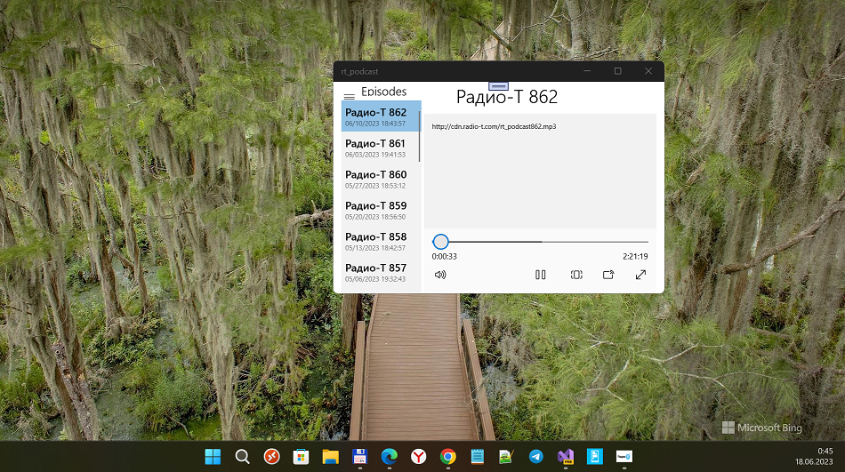

## Radio-T-UWP

Radio-T podcast app for Windows 10 (Mobile).

Based on Coding Blocks Podcast UWP App :)

## Screenshots

## Tech. details
- Fast creating of this UWP app with Windows Template Studio. :)
- iPodcastSearch -> cross-platform, .NET Standard 1.4
- Min. Win. OS build (SDK) = 10240 (Astoria compatibility)
Targets: x64; ARM32

## Bugs / Problems / Todos
* On W10M Astoria : app fails on starting :(
* No background tasking 
* No podcast description (xml parsing needed)
* Settings Page has bad mobile design at Portrait mode

## Learning Resources for DIY
* Watch the video about this project: https://www.youtube.com/watch?v=lv_mWybB1PM
* Watch the episode w/ the creators of Windows Template Studio: https://www.youtube.com/watch?v=FphkMm-mTmA
* Check out the blog post: http://www.codingblocks.net/podcast/how-to-jumpstart-your-next-app/

## ..
As is. No support. Radio-T is IT geeks podcast (in Russian language).

## .
MediaExplorer 2023

